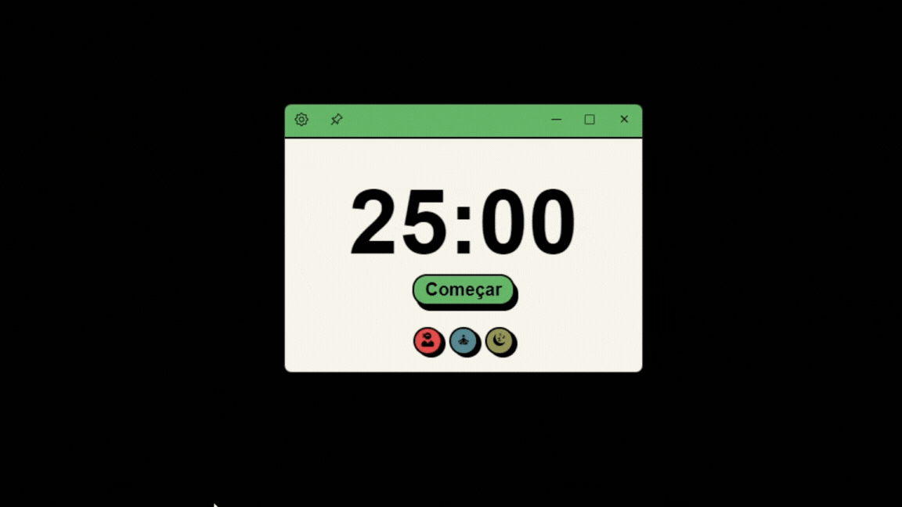

# 🕒 Pomodoro App

Este é um app desktop de Pomodoro desenvolvido com React, Vite e Electron.

A técnica Pomodoro é uma metodologia de gerenciamento de tempo que alterna períodos de foco com pequenas pausas, ajudando na produtividade e no controle do tempo. Ideal para estudos, trabalho ou qualquer tarefa que exija concentração.

💡 Curiosidade: Esse projeto nasceu durante um final de semana quando me despertou a curiosidade sobre o Eletron!

## 🚀 Funcionalidades
Temporizador baseado na técnica Pomodoro (25 min foco / 5 min pausa).

Interface simples, leve e intuitiva.

Feito para rodar como app desktop (Windows).

Experiência responsiva e fluida com tecnologias web modernas.

## 🛠️ Tecnologias

## 📦 Download
Você pode baixar a versão mais recente aqui

[🔗 Download](https://drive.google.com/file/d/1R8oRBqKoerkRnmUx6f5XwMJYxLglK_az/view)

